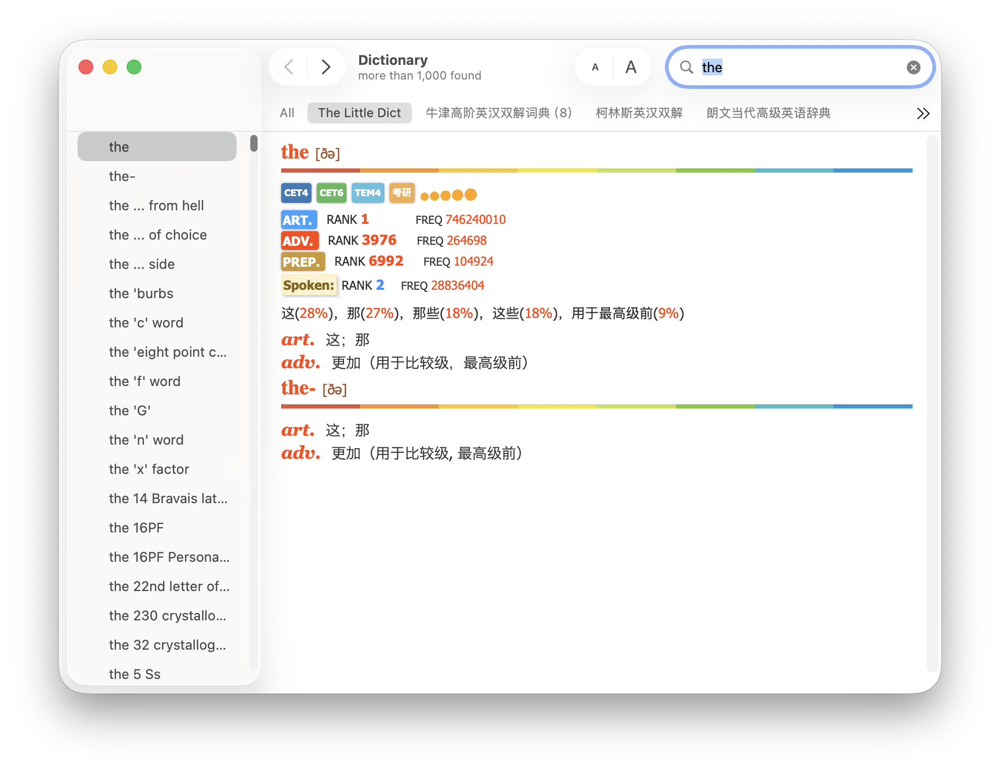
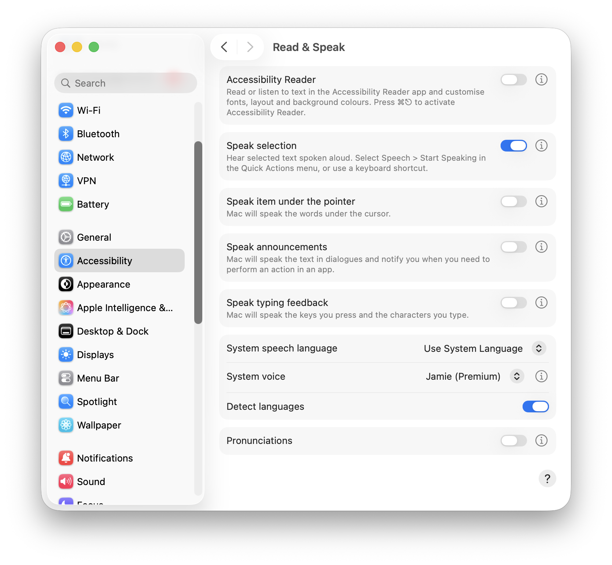
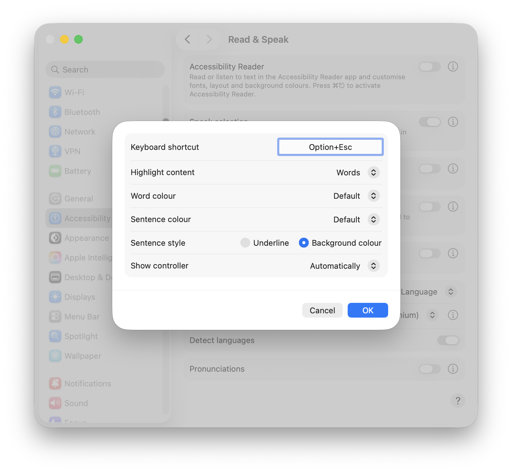
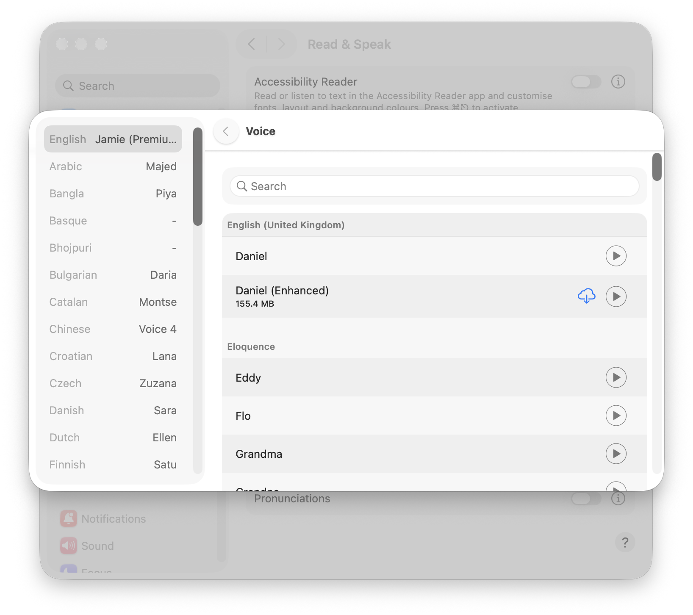

# [分享] The Little Dict (Apple Dictionary 格式) - macOS 专用

## 简介

**The Little Dict** 是一款非常经典的词典，原版为 MDX 格式，虽然很好用，但是没法用macOS三指触摸查词，macOS的原生查词还是太方便了，一按即查词，这是任何第三方软件很难做到的。因此，为了方便 macOS 用户原生使用，我将其转换成了苹果词典（.dictionary）格式，并打包成了 DMG 镜像，方便安装和分享。

## 资源说明
- **词典名称**：The Little Dict
- **目标平台**：macOS
- **格式**：Apple Dictionary Service (.dictionary)
- **文件大小**：约 1.3 GB
- **制作说明**：由 MDX 原版转换而来，保留了原有的样式和排版。

## 安装方法
1. 下载并打开 `The_Little_Dict.dmg`。
2. 将 `The_Little_Dict.dictionary` 拖拽到镜像中的 `User_Dictionaries` 快捷方式（指向 `~/Library/Dictionaries`）。
3. 打开 macOS 自带的 **词典 (Dictionary)** 应用。
4. 在菜单栏点击 **设置 (Settings/Preferences)**，勾选 "The Little Dict" 即可启用，拖动可排序，需要首个显示的话排到第一位。
5. 现在你可以在 Spotlight 或使用三指取词直接查看该词典内容。

## 关于发音的说明 (重要)
由于原词典的发音库 (MDD) 体积巨大，为了保证下载体验和仓库的轻量化，本转换版 **不包含离线发音库**。

不过，macOS 自带了极其强大的 **TTS (Text-to-Speech)** 功能，发音非常自然，完全可以替代 MDD：

### 如何配置 macOS 原生朗读发音：
1. 打开 **系统设置 (System Settings)** -> **辅助功能 (Accessibility)** -> **朗读内容 (Read & Speak)**。
2. 打开 **“朗读所选内容” (Speak selection)** 开关。
3. 点击右侧的 **“i” (感叹号)** 图标，可以自定义快捷键（默认为 `Option + Esc`）。
   
   
4. 在 **“系统语音” (System voice)** 旁点击感叹号，选择你喜欢的发音。建议选择带有 **Enhanced** 或 **Premium** 标签的高质量语音（例如英音 Jamie 或美音 Samantha），音质非常出色。
   
5. **使用方法**：在词典中选中单词或例句，按下快捷键（如 `Option + Esc`）即可即时朗读。

## 开发者说明 (源码维护)
本仓库的 `src` 目录下包含了构建该词典所需的样式表和配置文件。如果你想修改外观或更新词条：

1. 安装 [Apple Dictionary Development Kit](https://developer.apple.com/download/all/?q=Dictionary%20Development%20Kit)。
2. 准备好你的 `The_Little_Dict.xml` 数据文件（通常由 MDX 转换而来）。
3. 将 XML 放入 `src` 目录。
4. 在 `src` 目录下运行 `make` 命令进行编译。
5. 运行 `make install` 将生成的词典安装到系统目录。

**核心文件说明：**
- `The_Little_Dict.css`: 控制词典排版样式。
- `config.ini` & `fy.js`: 词典的功能开关和交互逻辑。
- `Makefile`: 构建脚本。

## 下载链接
> **提示**：由于文件体积较大，建议使用支持断点续传的工具下载。**笔者很讨厌百度网盘和国内一众需要登录才能下载还限速的网盘，虽然Google Drive或者OneDrive方便，但考虑到中国大陆用户不便访问，本资源仅在本人GitHub和FreeMDict帖子获取。**

---
*声明：本资源仅供学习交流使用，版权归原作者所有。如果喜欢请支持原版。*

